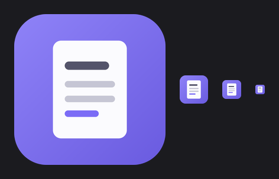

# Быстрые заметки (QuickNotes)

Лёгкая утилита для Windows: **создание текстовых файлов в один клик**.

Вы создаёте собственные кнопки — каждая со своим названием и привязанной папкой.
Нажатие на кнопку открывает окно заметки, в котором имя файла уже заполнено
текущей датой (например `2026-09-09.txt`), остаётся ввести текст и нажать
«Сохранить» — файл появится в папке кнопки.

## Возможности

- 🔘 **Свои кнопки** — название + папка, в которую будут сохраняться `.txt`-файлы
- 📅 **Имя по умолчанию — текущая дата** (`yyyy-MM-dd`); если заметка за день уже
  есть, автоматически предлагается имя `2026-09-09 (2).txt` и т.д.
- ✏️ **Окно редактирования** — правка имени и текста, кнопка «Сохранить»
- 🖱 **Правый клик по кнопке** — «Изменить», «Удалить», «Открыть папку»
- 💾 Файлы сохраняются в **UTF-8** (корректно открываются в Блокноте)
- 🌓 Тёмная тема интерфейса (WPF)

## Быстрый старт

1. Скопируйте папку `QuickNotes` на компьютер с Windows 10/11.
2. Запустите **`Start QuickNotes.bat`** — приложение откроется без окна консоли.

   > Альтернатива: правый клик по `QuickNotes.ps1` → «Выполнить с помощью PowerShell».

3. При первом запуске сразу откроется создание первой кнопки:
   введите название (например, «Работа») и выберите папку — готово.

### Ярлык на рабочий стол (по желанию)

1. Правый клик по `Start QuickNotes.bat` → **Отправить** → **Рабочий стол (создать ярлык)**.
2. Свойства ярлыка → «Окно» → **Свёрнутое в значок** — чтобы даже мигание
   консоли было незаметным.

## Иконка приложения



Иконка (фиолетовый квадрат с заметкой в стиле интерфейса) **встроена прямо в
скрипт**, поэтому окно, панель задач и переключение Alt+Tab уже показывают
значок — при запуске как одного `QuickNotes.ps1`, так и через лаунчер.

Файл `AppIcon.ico` в папке приложения — та же иконка для ярлыков Windows
(сами `.bat`/`.ps1` файлы собственного значка показать не могут):

1. Свойства ярлыка → **Сменить значок…** → выберите `AppIcon.ico` в папке
   приложения.
2. После этого ярлык можно закрепить на панели задач: правый клик по ярлыку →
   **Закрепить на панели задач**.

## Управление

| Действие | Как |
|---|---|
| Добавить кнопку | кнопка «+ Добавить кнопку» или `Ctrl+N` |
| Создать заметку | левый клик по кнопке |
| Изменить / удалить кнопку, открыть папку | правый клик по кнопке |
| Сохранить заметку | кнопка «Сохранить» или `Ctrl+S` |
| Закрыть окно заметки | `Esc` или «Отмена» |
| Перейти от имени к тексту | `Enter` в поле имени |

Если при сохранении файл с таким именем уже существует, приложение спросит:
перезаписать, сохранить с номером в имени или вернуться к редактированию.

## Где хранятся настройки

Список кнопок лежит в `buttons.json`:

- по умолчанию — **рядом со скриптом** (удобно переносить папку целиком);
- если папка программы без прав записи (например, `Program Files`) —
  в `%APPDATA%\QuickNotes\buttons.json`.

Формат файла простой:

```json
{
    "buttons": [
        { "name": "Работа", "folder": "C:\\Notes\\Work" },
        { "name": "Идеи", "folder": "D:\\Ideas" }
    ]
}
```

## Требования

- Windows 10 или 11
- Встроенный Windows PowerShell 5.1 — **ничего устанавливать не нужно**

## Настройка под себя

В начале `QuickNotes.ps1` можно поменять:

```powershell
$script:DateFormat = 'yyyy-MM-dd'   # формат имени новой заметки
$script:Extension  = '.txt'         # расширение создаваемых файлов
```

## Проверка работоспособности

Встроенный режим самотеста (проверяет очистку имён файлов, генерацию
уникальных имён, чтение/запись JSON, встроенную иконку и разметку окон) — без GUI:

```
powershell -NoProfile -ExecutionPolicy Bypass -File QuickNotes.ps1 -SelfTest
```
